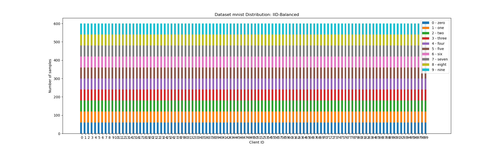
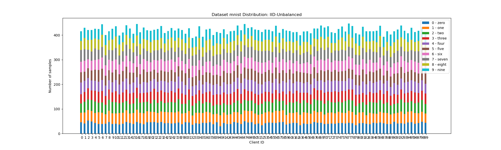
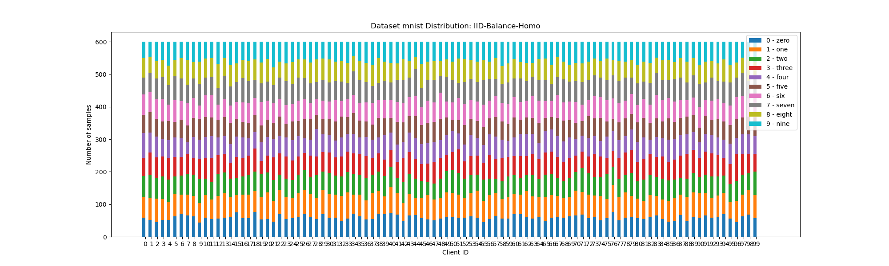
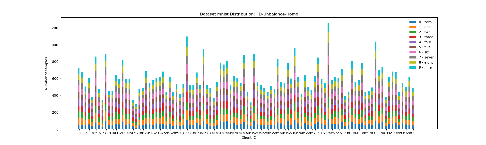
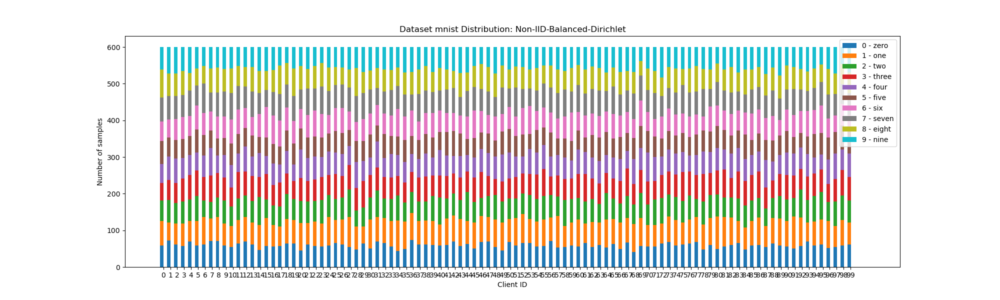
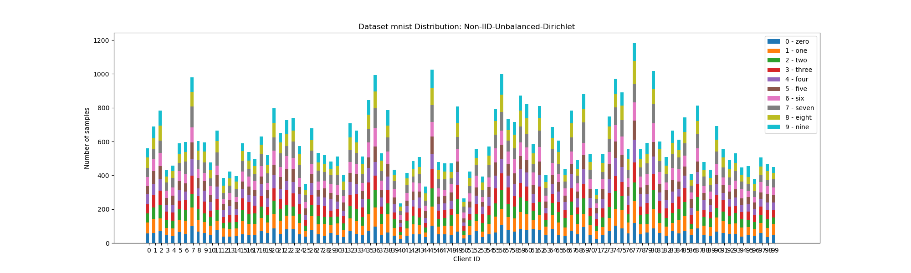
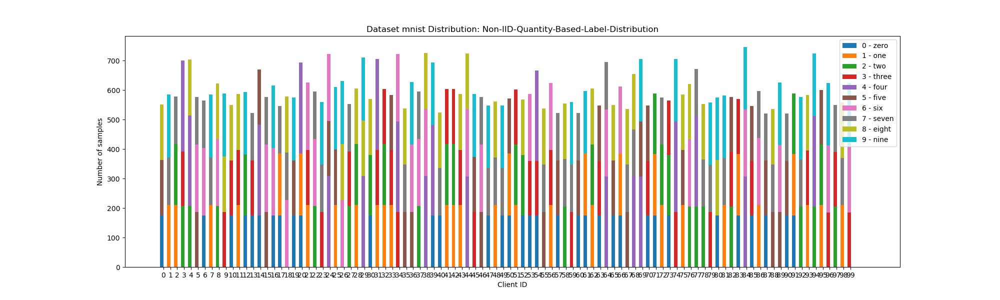
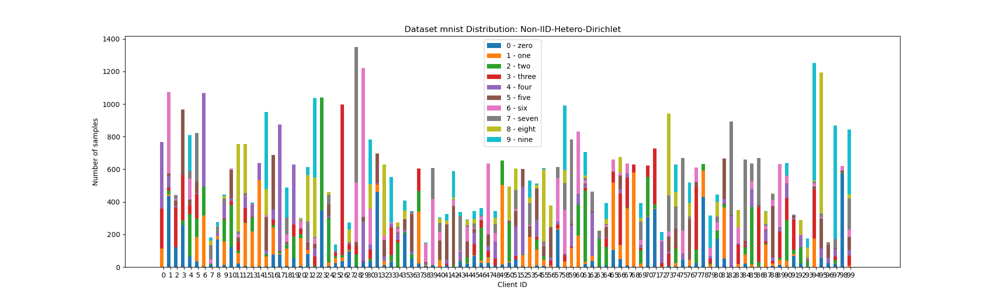
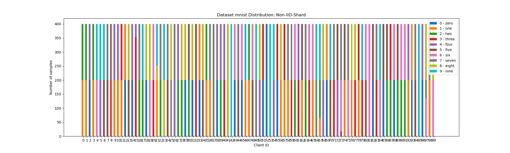
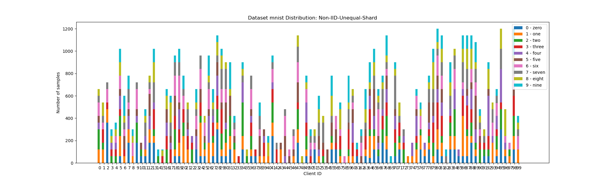

## Datasets and Separation
This project has generated Ten data distributions of MNIST, Fashion-Mnist and Cifar-10, as follows:
- Balanced-IID (two)
- Unbalanced-IID (two)
- Balanced Shards
- Unbalanced Shards
- Quantity-Based-Label-Distribution ()
- Hetero-Dirichlet
- Balanced-Dirichlet
- Unbalanced-Dirichlet

## Visualize the division results and Generation Data Steps
##### Steps1
When selecting parameters of the argparse, select the appropriate dataset and partition method. Then, perform the following procedures to obtain the specified data partition results
```bash
cd Fed-DP/dataset
python generate_data.py  # for MNIST iid_balanced_100
```

##### Steps2 
Specifies that the partition results of the dataset are displayed. 

```bash
cd Fed-DP/dataset
python show_clientdata.py  # Input Dataset Name (e.g. MNIST)
```

## Show IID Distribution
<table>
    <tr>
        <td ><center>fig.1 IID-Balanced</center></td>
        <td ><center>fig.2 IID-Unbalanced</center></td>
    </tr>
    <tr>
        <td><center>fig.3 IID-Unbalanced-Homo</center></td>
        <td ><center>fig.4 IID-Unbalanced-Homo</center> </td>
    </tr>
</table>

## Show Non-IID Distribution
<table>
    <tr>
        <td ><center>fig.1 Non-IID-Balanced-Dirichlet</center></td>
        <td ><center>fig.2 Non-IID-Unbalanced-Dirichlet</center></td>
    </tr>
    <tr>
        <td><center>fig.3 Non-IID-Quantity-Based-Label-Distribution.png</center></td>
        <td ><center>fig.4 Non-IID-Hetero-Dirichlet.png</center></td>  
    </tr>
    <tr>
        <td><center>fig.5 Non-IID-Unequal-Shard</center></td>
        <td ><center>fig.6 Non-IID-Unequal-Shard</center> </td>
    </tr>
</table>